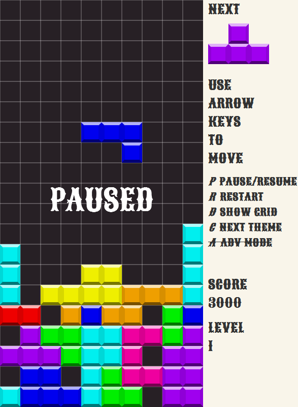

我第三个动画游戏。

# 俄罗斯方块

## 截图


## 起源

* [俄羅斯方塊](zh.wikipedia.org/zh/俄羅斯方塊)
* [Tetris](http://en.wikipedia.org/wiki/Tetris)

## 所得

见 [NOTE.md](./NOTE.md) 总结

## 使用

```
// 网格单位长度, 默认 40
// TetrisGame.unit = 20;

// 显示网格线, 默认 true
TetrisGame.showGrid = true;

// 主题类型 ["classic", "window", "bubble"]
TetrisGame.theme = 'classic';

// canvas,列数，行数，缩放
TetrisGame.init('#snake-game',10,20,1);
// TetrisGame.init('#snake-game',10,20,.5);
```